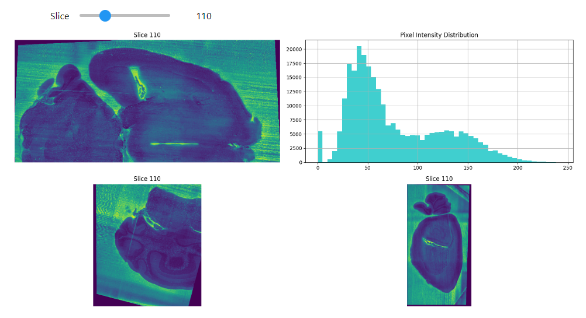
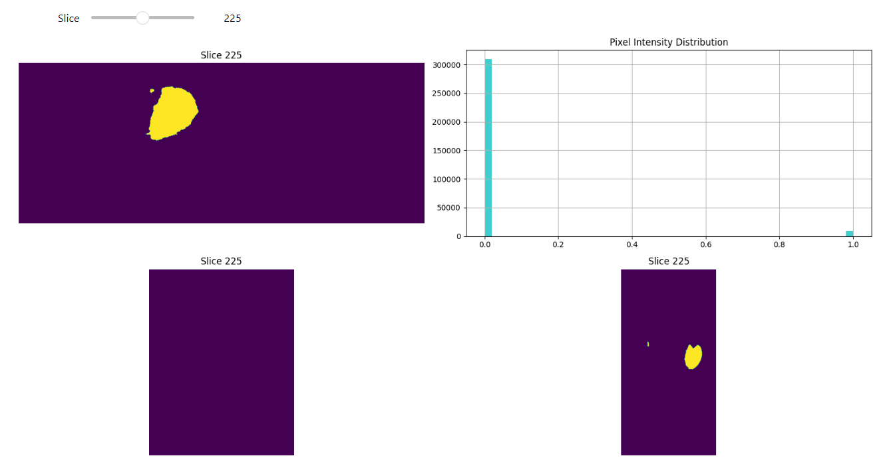
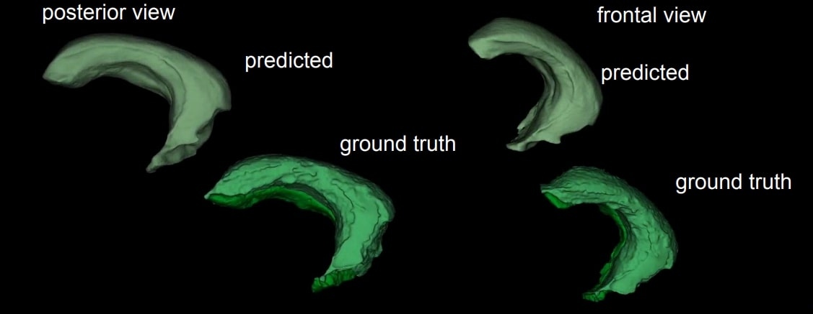

# Automated 3D Microscopic Volume Analysis for Hippocampus Segmentation in Mouse Brain

## Introduction
This repository contains scripts and utilities for processing and analyzing medical imaging datasets, particularly focusing on the Hippocampus Segmentation. The scripts are primarily aimed at preprocessing tasks such as data conversion, augmentation, and evaluation.

## Requirements
- Python 3.x
- NVIDIA GPU (for accelerated processing)
- Dependencies listed in `requirements.txt`

## Setup Instructions
1. **Check GPU Availability**:
   Execute `!nvidia-smi` to ensure that a compatible NVIDIA GPU is available for accelerated processing.

2. **Create Conda Environment**:
   ```bash
   conda create --name hippocampus_seg_env python=3.x

   conda activate hippocampus_seg_env


## Dataset Information
- **Training Dataset**: `{BASE_PATH}/dataset/nnUNet_raw_data/{task_name}/imagesTr`
- **Ground Truth Training Dataset**: `{BASE_PATH}/dataset/nnUNet_raw_data/{task_name}/labelsTr`
- **Test Dataset**: `{BASE_PATH}/dataset/nnUNet_raw_data/{task_name}/imagesTs`
- **Ground Truth Test Dataset**: `{BASE_PATH}/dataset/nnUNet_raw_data/{task_name}/labelsTs`

## Usage
- After setup and preprocessing, various utility functions and scripts are available for:
  - Data visualization
  - Evaluation metrics calculation
  - Model training and evaluation

## Slice Visualisation



## Prediction


## Additional Notes
- This repository is designed to work with the nnUNet framework for medical image segmentation tasks.

For more detailed information, refer to the documentation and source code.
