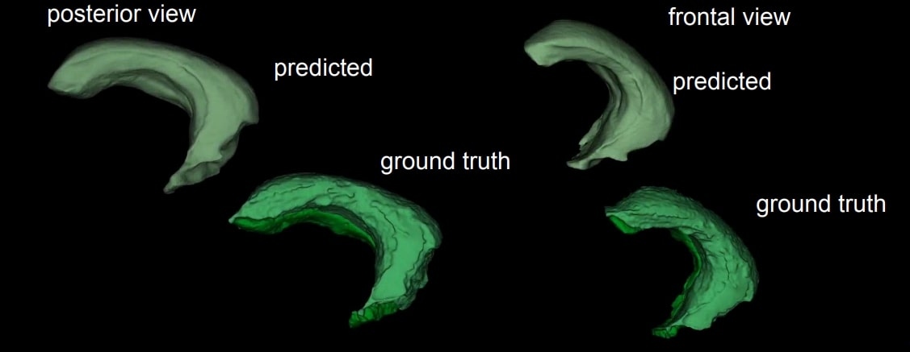

# brainXtract
Datathon2024 - Challenge #2

## Datathon 2024 - Défi n°2

### Team Members:
- Porteur médical: Stephan Collins
- Porteur numérique: [Antoine Schieb](https://github.com/antoineschieb)
- Etudiants:
  - Victor Alexandre
  - Pierre Lambert
  - [Zhiling Qian](https://github.com/NICKQZL)
  - [Taiabur Rahman](https://github.com/taiaburbd)
  - Laya Salazar Lafon
  - Emilia Skutunova
  - Alain Vitrey
## Objective:
The central objective of NeuroGeMM (inserm1231) is to establish an atlas of morphogens of the CNS using the mouse as a model.

## Projects:
- **3D image preprocessing**

- **Bottlenecks:**
  1. No AI: Morphological operations, thresholding, connected components
  2. Training a small segmentation model from scratch: UNet
  3. nnUnet, big configurable model
  4. A generative AI approach: pix2pix

- **Challenges:**
  - Images are heavy (20-30GB)
  - Binary segmentation of the whole brain on a 3D volume
  - Low contrast (hippocampus against brain background)

## Approaches:
1. **Binary Segmentation:**
   - Brain against the background
   - Specific brain region (hippocampus)
   - **1st Approach: NoAI Morphological Operation**
     - Gaussian Blur
     - 5x5 Binarization
     - Close 15x15
     - Open 15x15
   - **2nd Approach: Using 3 simple UNets**
     - Unet_XY
     - Unet_YZ
     - Unet_ZY
     - Intersection of 2D stacks (X3)
     - Dice score: 0.97 for 3D volume

2. **Small Components Removal:**
   - Visual demonstration of before and after

3. **Hippocampus Segmentation:**
   - Input volume: ~(4128, 2978, 1844) with ~ 25 to 35 gb
   - Down sample (5x)
   - nnUNet
   - 3D Binary Hippocampus
   - 5 fold cross-validation
   - Training time: 10h (0 fold)
   - Dice score: 0.88
  

4. **Pix2pix (Generative Model):**
   - Results images

## Datathon Website:
For more information about Datathon, visit [Datathon website](https://datathon.fr/).

## Contributors:
Victor Alexandre, Stephan Collins, Pierre Lambert, Zhiling Qian, Taiabur Rahman, Laya Salazar Lafon, Antoine Schieb, Emilia Skutunova, Alain Vitrey

